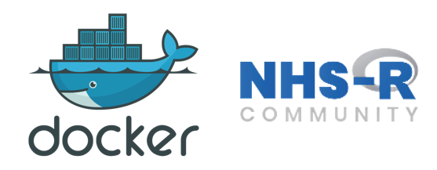

# Introduction to Docker and API deployment

This is a tutorial on how to use `Docker desktop` to deploy a trained machine learning model. There are many other use cases for Docker i.e. deployment of Shiny apps to docker containers, website deployment, web service deployment, database deployment or full scale application deployment. 

The session was part of the [NHS-R communities' workshop](https://nhsrcommunity.com/events/nhs-r-community-show-and-tell-r-in-production/). 

My tutorial will focus on the following:

1. Introduction to Docker
2. Docker Desktop 
3. Training ML Model, Serialise ML model and deploy to Docker container
4. Creating a Dockerfile and the Plumber API end points
5. Use CMD to interact with the service (Windows focus)
6. Expose Swagger APU and use R to connect to API and send predictions to the trained ML model
7. Interface with our API using httr and JSONlite

## Links to the tutorial content

The following links send you straight to the content:

* [Presentation from the day](https://github.com/StatsGary/NHS_R_Community_Intro_to_Docker/blob/main/Docker_NHSRCommunity/NHS_R_Community_Docker_Presentation.pdf)
* [ML Model training script](https://github.com/StatsGary/NHS_R_Community_Intro_to_Docker/blob/main/Docker_NHSRCommunity/MLModelTrainingScript.R) - this trains a model in caret and serialises it to the model folder in the Rocker_Deployment_R folder
* [Rocker Deployment Folder](https://github.com/StatsGary/NHS_R_Community_Intro_to_Docker/tree/main/Docker_NHSRCommunity/Rocker_Deployment_R) - this contains all the code needed to create the Docker image such as our [PlumbeR end point](https://github.com/StatsGary/NHS_R_Community_Intro_to_Docker/blob/main/Docker_NHSRCommunity/Rocker_Deployment_R/PlumbStranded.R) scripts, our GET and POST functions in [StrandedPlumberAPIHC.R](https://github.com/StatsGary/NHS_R_Community_Intro_to_Docker/blob/main/Docker_NHSRCommunity/Rocker_Deployment_R/StrandedPlumberAPIHC.R), the [Open API YAML file](https://github.com/StatsGary/NHS_R_Community_Intro_to_Docker/blob/main/Docker_NHSRCommunity/Rocker_Deployment_R/openapi.yaml) needed for setting up the structure of the [Swagger endpoint](http://127.0.0.1/__docs__/), the [serialised model (tb_model.rds)](https://github.com/StatsGary/NHS_R_Community_Intro_to_Docker/blob/main/Docker_NHSRCommunity/Rocker_Deployment_R/tb_model.rds) and the most important [Dockerfile](https://github.com/StatsGary/NHS_R_Community_Intro_to_Docker/blob/main/Docker_NHSRCommunity/Rocker_Deployment_R/Dockerfile).
* [Using Powershell to deploy model](https://github.com/StatsGary/NHS_R_Community_Intro_to_Docker/blob/main/Docker_NHSRCommunity/DOS_Code.txt) - this shows how to use command line to deploy the model in a couple of easy steps
* [Accessing our API once deployed](https://github.com/StatsGary/NHS_R_Community_Intro_to_Docker/tree/main/Docker_NHSRCommunity/AccessAPI) - this folder contains a script that takes unseen take, these are patients the model was not trained on, and uses our API to fetch the trained model, pass the unseen data through the model, the model spits out results and then these are bound back to the production data as probability estimates and class labels. It also converts a data frame into a [JSON object](https://github.com/StatsGary/NHS_R_Community_Intro_to_Docker/blob/main/Docker_NHSRCommunity/AccessAPI/Prod.json) and uses this object to pass to the API. The API returns JSON and then it converts it back to a data.frame. A bit of R and JSON magic!

## Want to follow along on YouTube?

This tutorial originally appeared on my YouTube channel. The links to the relevant videos and blogs are below:

* [Deploying a CARET Machine Learning model as an API with PlumbeR](https://www.youtube.com/watch?v=WMCkV_J5a0s) - this shows how to create the ML model, swagger endpoint, create the end point files needed and the OpenAPI.yaml file
* [Creating a classification model from scratch with TidyModels](https://www.youtube.com/watch?v=PtD5hgHM-DY) - this shows an alternate approach to it, instead of CARET replace with TidyModels.
* [Assessing classification model with ConfusionTableR and outputting matrix to database](https://www.youtube.com/watch?v=9zcUlgLySZo&list=PL37zlCA8GQdo-mObS7U6ViJduy9CyC5aI&index=15&t=322s) - this will show you how to use the Confusion Matrix object of R and then beable to store the results into a database with ConfusionTableR. 
* [Deploying our model to Docker](https://www.youtube.com/watch?v=JK6VLAKRjO4) - this steps you through how to create the Docker file, get everything in a docker folder for deployment, deploy to Docker with Powershell / CMD and then to consume the endpoint with swagger and JSON - making the model platform agnostic.
* [Accessing API and making predictions](https://www.youtube.com/watch?v=2OFtMtYyVsw) - this will show you how to use the Swagger API to make predictions on production / unseen data and return the results back to R in JSON. Then we convert the JSON and push it back out. 
* [Full article taking you through model training and deploying our model to Docker](https://hutsons-hacks.info/deploying-trained-caret-machine-learning-model-with-docker-and-plumber) - this is a link to the full article on my website.

## Need help with putting your model into production?

I have been doing lots with MLOps recently and have some practical tips for scaling the model up beyond this fully open-source solution, so please drop me a line if you want any help?

